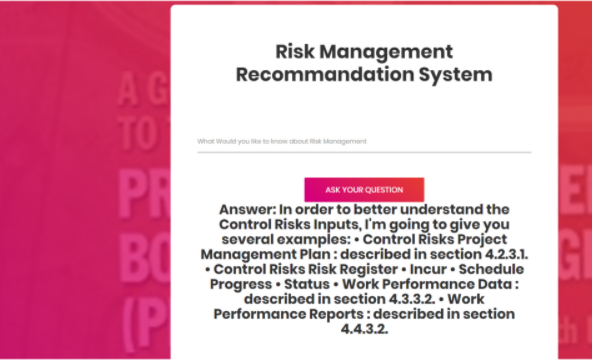

# Risk-management-khnowledge-based-system
This repository contains a risk management based knowledge system based on two pdf files from where we've got the necessary knowledge we need, follow those two links to get the necessary dataset: 
* [PMBOK-5th_Risk](./PMBOK%205th.pdf) 
* [PMIPracticeStandardforProjectRiskManagement](./PMIPracticeStandardforProjectRiskManagement.pdf)    
you can test this project by running the django project folder (running the server) as you see bellow :  
  
## **Overview**

---

A knowledge-based system (KBS) is a form of artificial intelligence (AI) that aims to capture the knowledge of human experts to support decision-making, this project aims to get knowledge of risk management by using the most two popular books, then by adding some semantic web terms we'd be able to extract entities and relations which means that our system is able to get the most important things that it should keep in mind. 
We did apply NLP techniques and now we have an ontology file that contains the knowledge extracted by the system (classes, subclasses, individuals, object properties, data properties and annotations) and you can open that file either with an IDE as visual code or by an ontology software as Protege. 
After extracting the knowledge we have to use a matching algorithm to compare between the customer request and the entities existing on the ontology file in order to get an accurate answer.
## **Description of files**

---

* DjangoProject1 : it's the deployment project (admin interface developed by django, /api where we had used rest framework ,and on /api/home you can find the principal interface as you see above.
* Text_preprocessing-6666.ipynb : it's the first notebbok you should analyze (it involves the first steps as preprocessing our data and applying nlp techniques)
* annotations.csv : contains the annotations we had figured them out by applying some filtering and patterns
* glove_cosine.ipynb : contains a few pieces of codes which verify the accuracy of the model we're going to use
* onto6.owl : the ontology file that we've got
* owl.ipynb : we leverage the datasets we've got from the first notebook to get the ontology file with the aid of owlready2(ontology's api)
* owl2.py : this is the third step where we had used the ontology to extract our entites and we had prepocessed the request to compare it then with the entities by using a matching model (the result of running this python script would be the answer of a written request, you could enjoy testing your customized requests)
* relation.csv : a csv file containig the relations we had found by using some patterns.
* subconcepts.csv : a csv file containig relations between classes and subclasses.
* ## **Important notes**

---

* Please follow that [link](https://www.kaggle.com/watts2/glove6b50dtxt) to download the glove.6b.50d.txt file that is necessary to train the glove model (this model use the embedding term to give us a significative vector instead of a word then we'll use the cosine similarity to calculate the similiraty between entites and the request entred by the customer).
* to better understand how to calculate text similarities i suggest to follow that [link](https://medium.com/@adriensieg/text-similarities-da019229c894) that contains several methods well explained.
* Finally please read about semantic web and ontologies otherwise you'd feel lost.
